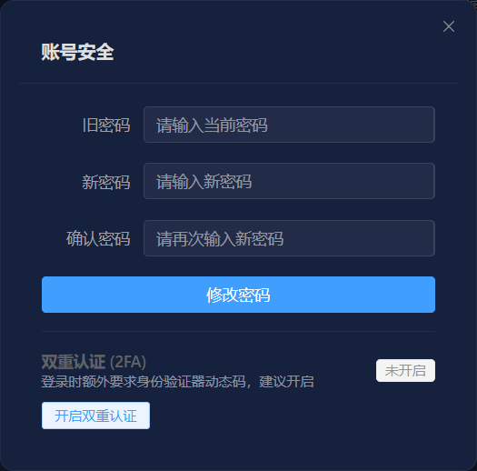
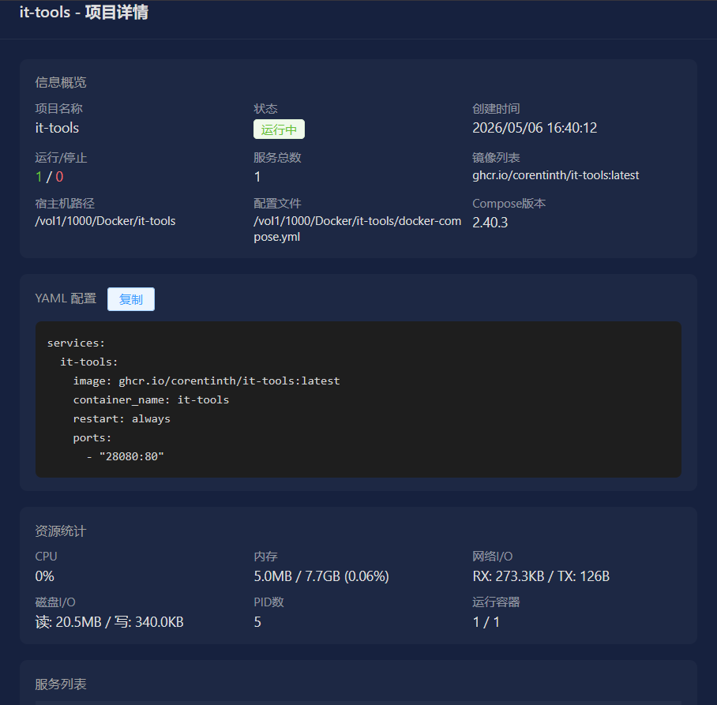
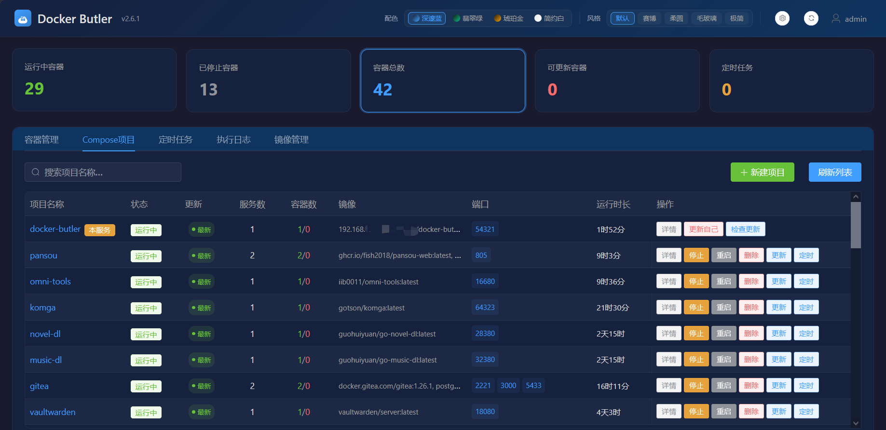
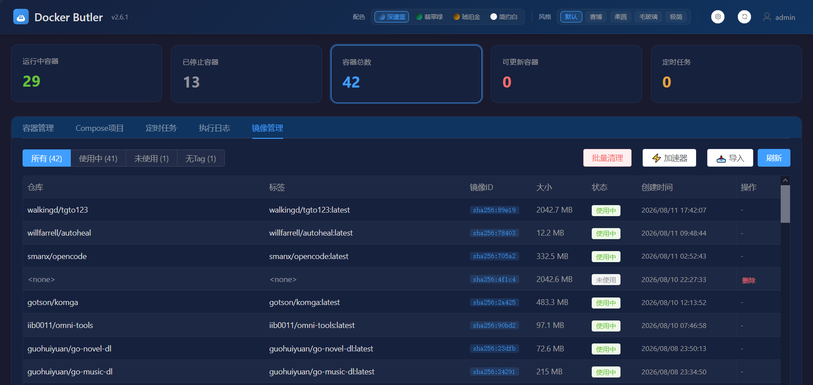
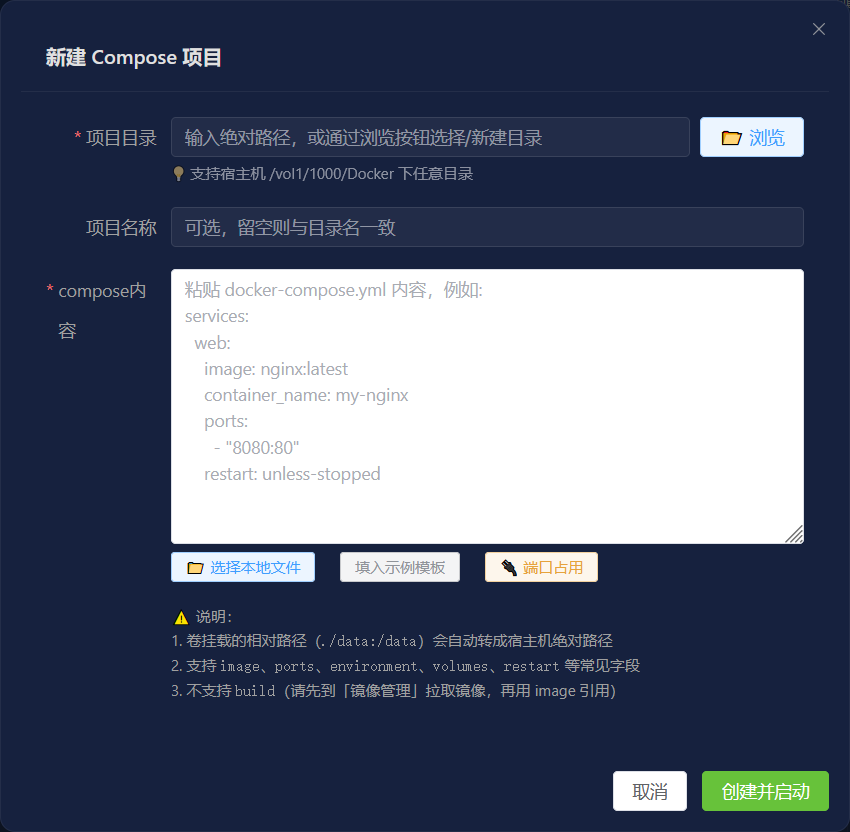
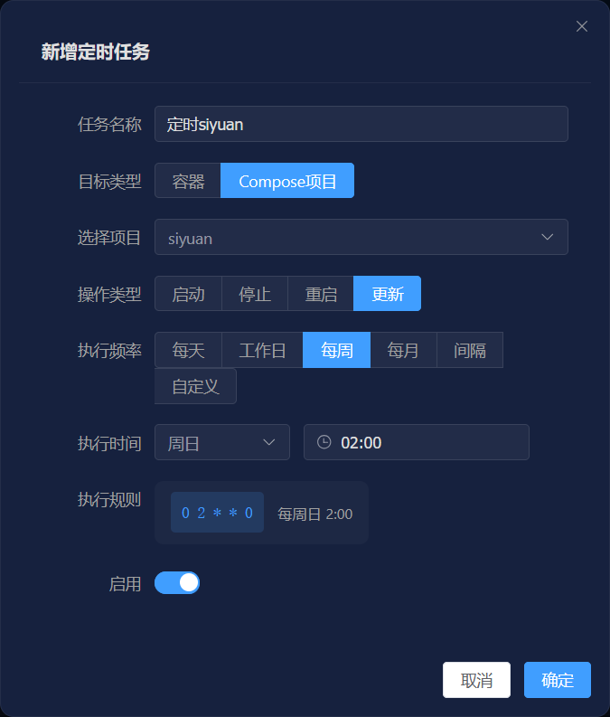

# Docker Butler 🐳（Docker 管家）

> Docker 容器调度管理面板：**定时启停容器、一键更新镜像、Compose 项目管理**，全在一个网页里搞定。
> 适配飞牛NAS / 群晖 / 绿联 / 威联通 / 任何 Linux + Docker 环境，手机端也能用。

[](LICENSE)

---

## ✨ 功能特性

| 能力 | 说明 |
| --- | --- |
| 容器管理 | 容器列表、CPU/内存/网络I/O/磁盘I/O 实时展示，一键启停/重启/删除，支持网页新建容器 |
| 定时调度 | 基于 Cron 表达式定时启停/重启/更新容器，支持 Compose 项目级调度，支持自然语言描述（不用背 Cron 语法） |
| 镜像更新 | 自动/手动检测远程新版本，一键更新（实时进度条），可逐容器开关 |
| Compose 项目管理 | 自动识别本机所有 Compose 项目，项目级启停/重启/更新，支持网页新建项目、目录浏览/新建、查看 YAML 配置 |
| 镜像管理 | 镜像列表、批量清理未使用/悬空镜像、**镜像加速器设置**（国内拉取提速）、**本地 tar 导入** |
| 本服务自更新 | 面板内一键更新自己（检测新版本 → 拉取镜像 → 自动重建），支持检查更新、重启本服务 |
| 端口占用扫描 | 一键查看宿主机全部占用端口（系统监听 + 容器映射），创建 Compose 前避开冲突端口 |
| 账号安全 | 双重认证 2FA（TOTP 验证码）、信任设备（30 天免验证码）、修改密码 |
| 视觉 | 4 种配色 + 5 种风格，暗色主题，手机端适配 |

## 🧬 技术架构

- 后端：Python FastAPI + Docker SDK + APScheduler
- 前端：Vue 3 + Element Plus（单页应用，无构建依赖）
- 存储：SQLite（轻量，无需额外数据库）
- 网络：bridge 端口映射（只暴露面板端口），`pid: host` 支持端口占用扫描读取宿主监听

```
宿主机
└── docker-butler 容器 (privileged + pid:host)
    ├── FastAPI (容器内 8383，映射宿主机 54321)
    ├── SQLite (/data/docker-butler.db)
    ├── Docker SDK → /var/run/docker.sock → 管理本机其他容器
    └── 挂载：compose 目录浏览 /host/compose、/host-vol1；镜像加速器 /etc/docker/daemon.json
```

## 📸 界面预览

> 截图存放在 `docs/配图/` 目录，图片命名规则：`01-容器列表.png` ... `08-账号安全.png`（序号+功能名）。

| 账号安全（2FA） | 容器详情 |
| --- | --- |
|  |  |

| Compose 项目 | 镜像管理 |
| --- | --- |
|  |  |

| 新建 Compose 项目 | 定时调度 |
| --- | --- |
|  |  |

## 🚀 快速开始

### 前提

- 本机已安装 Docker（含 Docker Compose v2）

### 方式一：Docker Compose（推荐）

新建 `docker-compose.yml`，内容如下，然后 `docker compose up -d`：

```yaml
services:
  docker-butler:
    image: docker.io/vindy-lu/docker-butler:latest
    container_name: docker-butler
    privileged: true          # 管理 Docker 需要特权模式，不能去掉
    pid: host                 # 让"端口占用扫描"能读取宿主监听端口（bridge 网络也能用）
    ports:
      - "54321:8383"          # 宿主机端口:容器内端口 —— 想换端口改左边数字即可
    volumes:
      - /var/run/docker.sock:/var/run/docker.sock
      - ./docker-butler-data:/data    # 数据目录（本项目目录下，方便查看/备份）
      - /etc/docker/daemon.json:/etc/docker/daemon.json   # 镜像加速器设置（可读写，面板内配置）
      # 下面两个挂载是给面板的"Compose 项目浏览/新建"功能用的（可选，不用可删）：
      - ${COMPOSE_ROOT:-/vol1/1000/Docker}:/host/compose   # 宿主机 Docker 项目目录
      - ${COMPOSE_VOLUME_ROOT:-/vol1}:/host-vol1           # 宿主机存储根目录
    environment:
      - TZ=Asia/Shanghai
      - DB_PATH=/data/docker-butler.db
      - APP_PORT=8383         # 容器内监听端口，与 ports 右边保持一致
      - COMPOSE_ROOT_HOST=${COMPOSE_ROOT:-/vol1/1000/Docker}
      - COMPOSE_VOLUME_ROOT_HOST=${COMPOSE_VOLUME_ROOT:-/vol1}
    restart: unless-stopped
```

### 方式二：docker run 一条命令

```bash
docker run -d \
  --name docker-butler \
  --restart unless-stopped \
  --privileged \
  --pid host \
  -p 54321:8383 \
  -v /var/run/docker.sock:/var/run/docker.sock \
  -v $(pwd)/docker-butler-data:/data \
  -v /etc/docker/daemon.json:/etc/docker/daemon.json \
  -e TZ=Asia/Shanghai \
  -e DB_PATH=/data/docker-butler.db \
  -e APP_PORT=8383 \
  docker.io/vindy-lu/docker-butler:latest
```

> 💡 可选挂载：如需在面板中管理宿主机 Compose 目录，追加
> `-v /vol1/1000/Docker:/host/compose -v /vol1:/host-vol1`
> （路径按你的 NAS 类型调整，见下表）。

### 方式三：从源码构建（无需拉镜像）

```bash
git clone https://github.com/vindy-lu/docker-butler.git
cd docker-butler
docker compose -f docker-compose.build.yml up -d --build
```

### 各 NAS 的挂载路径参考

| NAS 品牌 | 存储根（COMPOSE_VOLUME_ROOT） | Docker 项目目录（COMPOSE_ROOT） |
| --- | --- | --- |
| 飞牛 fnOS | `/vol1` | `/vol1/1000/Docker` |
| 群晖 Synology | `/volume1` | `/volume1/docker` |
| 绿联 UGREEN | `/volume1` | `/volume1/docker` |
| 威联通 QNAP | `/share` | `/share/Container` |
| 其它 Linux | `/` | `/opt/docker`（自定） |

> 💡 部署在非飞牛设备时，替换 compose 里的 `${COMPOSE_ROOT:-...}` 和 `${COMPOSE_VOLUME_ROOT:-...}` 默认值（或 export 同名环境变量），也可以直接删除这两个挂载（仅影响 Compose 目录浏览功能）。

---

启动完成后浏览器访问：`http://你的NASIP:54321`

**默认账号：`admin` / `admin`**（⚠️ 首次登录后请立即修改密码）

> 💡 **端口说明**：容器内监听 8383，映射到宿主机 54321。想换端口改 `54321:8383` 左边的数字即可；想换容器内端口，改 `APP_PORT` 和映射右边数字（保持一致）。

## 💬 反馈与支持

- 遇到问题欢迎提 [Issues](https://github.com/vindy-lu/docker-butler/issues)
- 技术交流 / 部署咨询：QQ **2801156198**
- 如果这个项目对你有帮助，可以请作者喝杯咖啡 ☕：


## 📚 文档

- [部署手册（完整版）](docs/部署手册.md) — 详细部署步骤、功能使用、FAQ

## ❓ 常见问题

| 现象 | 解决办法 |
| --- | --- |
| 拉镜像失败 | 国内网络可先在「镜像管理 → 加速器」配置国内镜像加速器，保存后重启 Docker 服务 |
| 面板打不开 | `docker ps` 看状态，`docker compose logs -f` 看日志；端口 54321 是否被占用 |
| 提示 privileged 警告 | 管理其他容器需要特权模式，不能去掉 |
| 忘记 admin 密码 | `docker compose down -v && docker compose up -d`（会清空配置，慎用） |
| 面板如何升级 | 面板内「本服务」行点「检查更新」→ 有更新后点「更新自己」，自动完成升级 |

## 📄 License

[MIT](LICENSE) © 2026 刘淦城
